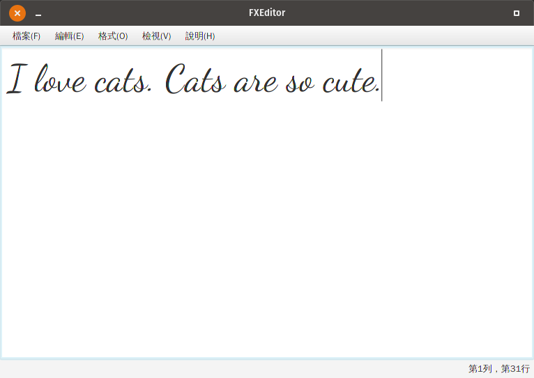

# FXEditor
盡可能地模仿了MS Notepad，順便練習一下JavaFX  

# Download
- Windows:[ 載點](https://github.com/gotchamana/FXEditor/releases/download/v1.0/Win64.zip)
- Linux: [載點](https://github.com/gotchamana/FXEditor/releases/download/v1.0/Linux64.zip)

# Usage
進入bin資料夾中找到launch的批次檔，點擊兩下即可使用
